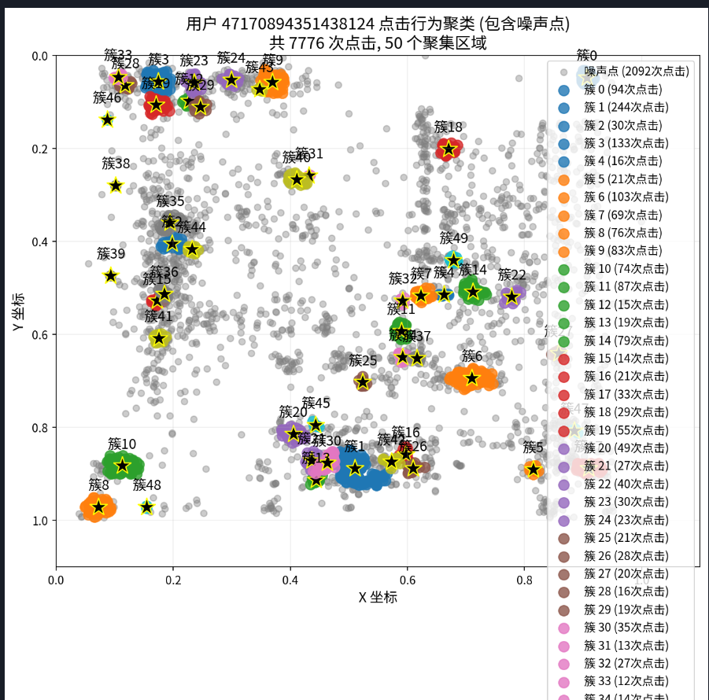
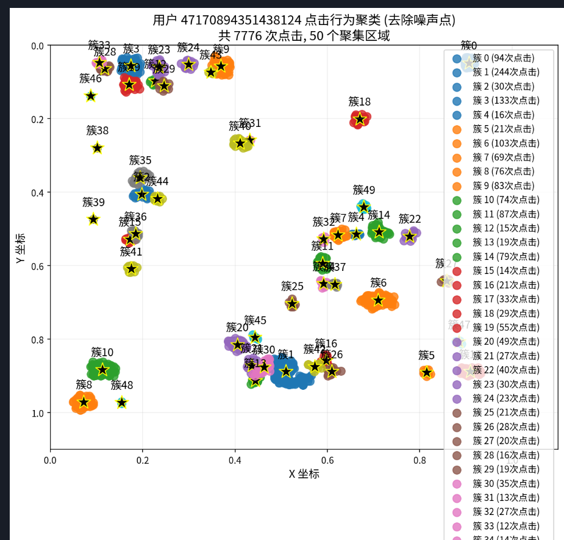
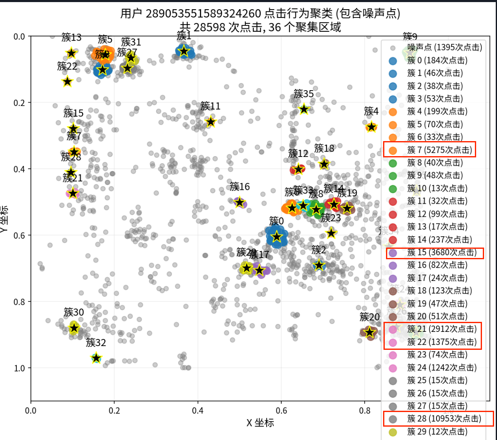
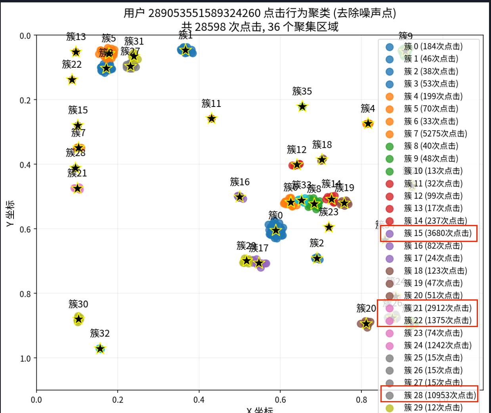

# 🎯 点击聚类分析系统

基于加权DBSCAN算法的用户点击行为分析和脚本用户检测系统

## 📋 项目概述

本项目通过分析用户的点击坐标数据，使用改进的DBSCAN聚类算法识别点击模式，并基于双重检测机制自动识别脚本用户和正常用户。系统能够有效区分人工操作和自动化脚本的点击行为模式。

## 🧠 核心算法原理

### 1. 加权DBSCAN聚类算法

传统DBSCAN算法只考虑点的位置，而本系统实现的**加权DBSCAN**同时考虑点击次数作为权重：

```
核心思想：点击次数越多的位置，在聚类中的重要性越高
```

**算法流程：**
1. **数据预处理**：将每个点击位置根据其点击次数进行复制（权重模拟）
2. **邻域计算**：使用欧几里得距离计算ε邻域内的所有点
3. **核心点识别**：加权邻居数 ≥ min_samples 的点标记为核心点
4. **簇扩展**：从核心点开始深度优先搜索，连接密度可达的点
5. **噪音标记**：未被分配到任何簇的点标记为噪音点

**关键参数：**
- `EPS = 0.01`：邻域半径，控制聚类的紧密程度
- `MIN_SAMPLES = 10`：最小样本数，控制核心点的判定标准

### 2. 脚本用户检测机制

系统采用**双重判断标准**来识别脚本用户，只要满足以下任一条件即判定为脚本用户：

#### 判断标准一：噪音点比例检测
```
噪音点比例 = 噪音点点击次数 / 总点击次数 ≤ 10%
```
**逻辑原理：** 脚本用户的点击位置通常非常精确和重复，很少产生随机的、孤立的点击，因此噪音点比例很低。

#### 判断标准二：点击集中度检测
```
前三大簇占比 = (前三个最大簇的点击次数之和) / 总点击次数 ≥ 80%
```
**逻辑原理：** 脚本用户倾向于在少数几个固定位置进行大量重复点击，而正常用户的点击更加分散。

### 3. 检测逻辑的数学表达

```python
is_script = (noise_ratio ≤ 0.1) OR (top3_ratio ≥ 0.8)
```

这种"或"逻辑确保了两种典型的脚本行为模式都能被捕获：
- **高精度脚本**：点击非常精确，噪音极少
- **集中点击脚本**：在少数位置大量重复点击

## 🖼️ 可视化结果说明

系统为每个用户生成四种类型的可视化图像，展示不同的分析维度：

### 正常用户 vs 异常用户对比

#### 🟢 正常用户特征图像


**正常用户（含噪音点）**
- **特征**：点击分布相对分散，存在较多噪音点（灰色）
- **噪音点**：代表随机的、孤立的点击行为
- **簇分布**：多个小簇，点击相对均匀分布
- **人工行为特征**：体现了人类操作的随机性和不确定性


**正常用户（去除噪音点）**
- **清晰展示**：去除噪音后的主要点击簇
- **簇特征**：多个中等大小的簇，无明显的超大簇
- **分布特征**：簇之间相对均衡，无极端集中现象

#### 🔴 异常用户（脚本）特征图像


**异常用户（含噪音点）**
- **特征**：点击高度集中，噪音点极少或无噪音点
- **集中性**：大部分点击集中在少数几个位置
- **规律性**：体现了脚本的精确性和重复性
- **异常信号**：缺乏人工操作应有的随机性


**异常用户（去除噪音点）**
- **极端集中**：1-3个超大簇占据绝大部分点击
- **簇大小差异**：主要簇与次要簇之间存在巨大差异
- **脚本特征**：完美体现了自动化程序的行为模式

### 四图对比分析

| 图像类型 | 噪音点显示 | 主要用途 | 关键观察点 |
|----------|------------|----------|------------|
| 正常用户-含噪音 | ✅ 显示 | 观察整体分布 | 噪音点数量和分布 |
| 正常用户-去噪音 | ❌ 隐藏 | 分析主要簇 | 簇的数量和大小均衡性 |
| 异常用户-含噪音 | ✅ 显示 | 检测异常模式 | 噪音点稀少程度 |
| 异常用户-去噪音 | ❌ 隐藏 | 确认集中度 | 主要簇的极端集中程度 |

## 🔧 环境配置

### 依赖包要求
```bash
pip install pandas numpy scikit-learn matplotlib seaborn tqdm
```

### 版本要求
```
Python >= 3.7
pandas >= 1.3.0
numpy >= 1.21.0
scikit-learn >= 1.0.0
matplotlib >= 3.5.0
seaborn >= 0.11.0
tqdm >= 4.60.0
```

## 📊 数据格式

### 输入数据格式
```
用户ID|坐标x#坐标y|点击次数
4298554613968662319|0.5#0.3|1
6554381665229910872|0.2#0.8|3
```

### 字段说明
- **用户ID**：唯一用户标识符
- **坐标**：屏幕坐标，归一化到[0.0, 1.0]范围
- **点击次数**：该坐标点的累计点击频次

## 🚀 使用方法

### 1. 快速开始
```bash
# 克隆项目
git clone [项目地址]
cd 点击聚类

# 安装依赖
pip install -r requirements.txt

# 运行分析
python click.py
```

### 2. 参数配置
```python
# 在click.py中修改以下参数
DATA_PATH = "你的数据文件路径"
EPS = 0.01          # 聚类半径
MIN_SAMPLES = 10    # 最小样本数
OUTPUT_DIR = "输出目录"
```

### 3. 性能测试
```bash
# 运行性能测试
python click.py --test
```

## 📈 输出结果

### 目录结构
```
output/
├── Results/                    # 总体分析结果
│   ├── detection_results.csv   # 所有用户检测结果
│   ├── script_users.csv        # 脚本用户列表
│   ├── joint_distribution.png  # 联合分布图
│   ├── noise_ratio_distribution.png    # 噪音比例分布
│   └── top3_ratio_distribution.png     # 前三簇占比分布
├── ScriptUsers/               # 脚本用户详细数据
│   └── [用户ID]/
│       ├── [用户ID]_clusters.csv
│       ├── [用户ID]_with_noise.png
│       └── [用户ID]_without_noise.png
└── NormalUsers/               # 正常用户详细数据
    └── [用户ID]/
        ├── [用户ID]_clusters.csv
        ├── [用户ID]_with_noise.png
        └── [用户ID]_without_noise.png
```

### 检测结果字段
| 字段 | 类型 | 说明 |
|------|------|------|
| `user_id` | string | 用户ID |
| `is_script` | boolean | 是否为脚本用户 |
| `total_clicks` | int | 总点击次数 |
| `noise_clicks` | int | 噪音点点击次数 |
| `noise_ratio` | float | 噪音点比例 |
| `cluster_count` | int | 簇数量 |
| `top3_ratio` | float | 前三大簇占比 |
| `top3_clusters` | list | 前三大簇ID |
| `user_type` | string | 用户类型标签 |

## ⚙️ 高级配置

### 性能优化参数
```python
ENABLE_PARALLEL = True      # 启用并行处理
MAX_WORKERS = 8             # 最大工作进程数
GENERATE_PLOTS = True       # 是否生成可视化图像
USE_OPTIMIZED_DBSCAN = True # 使用优化的DBSCAN算法
OPTIMIZED_PLOTS = True      # 优化图像生成速度
```

### 检测阈值调整
```python
# 提高检测敏感度（更容易判定为脚本）
noise_threshold = 0.05      # 降低噪音阈值至5%
top3_threshold = 0.70       # 降低集中度阈值至70%

# 降低检测敏感度（更严格的判定）
noise_threshold = 0.15      # 提高噪音阈值至15%
top3_threshold = 0.90       # 提高集中度阈值至90%
```

## 🎯 应用场景

- **🎮 游戏反作弊**：检测游戏中的自动化脚本和外挂程序
- **🌐 网站安全**：识别爬虫和自动化访问行为
- **📱 移动应用**：检测应用中的虚假操作和刷量行为
- **💰 广告反欺诈**：识别虚假点击和恶意流量
- **📊 用户行为分析**：区分真实用户和机器人行为

## 🔍 算法优势

1. **高准确性**：双重检测机制，降低误判率
2. **强适应性**：参数可调，适应不同应用场景
3. **高效率**：支持并行处理，适合大规模数据
4. **可解释性**：提供详细的可视化和统计分析
5. **易扩展**：模块化设计，便于功能扩展

## 📝 注意事项

1. **数据质量**：确保输入数据格式正确，坐标范围在[0.0, 1.0]
2. **参数调优**：根据具体场景调整EPS和MIN_SAMPLES参数
3. **内存管理**：大数据集建议启用并行处理或分批处理
4. **结果验证**：建议结合业务逻辑验证检测结果的合理性

## 🔄 更新日志

- **v2.0** (2025-01): 重写README，详细说明算法原理和图像区别
- **v1.2** (2024-12): 增加统计分析和分布可视化功能
- **v1.1** (2024-11): 添加中文字体支持，优化可视化效果
- **v1.0** (2024-10): 基础功能实现，支持加权DBSCAN和脚本检测

---

**开发团队** | **最后更新**: 2025年1月 | **技术支持**: 请提交Issue或联系开发团队